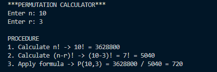
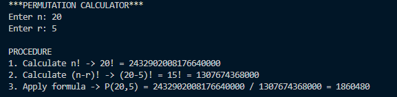
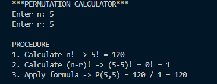
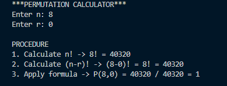
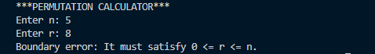
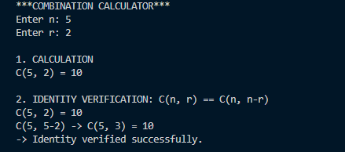
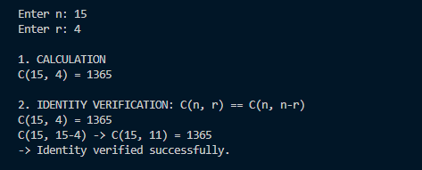
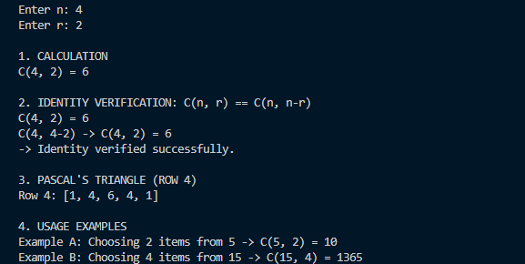
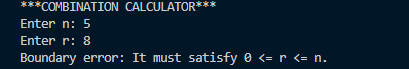

# Bono de Programación - Matemáticas Discretas I

**Nombre:** Mariana Garcia

Este repositorio contiene la solución a dos problemas generales de conteo, cumpliendo con la traducción del razonamiento matemático a herramientas computacionales. Se incluye el código fuente, explicaciones y evidencias de pruebas.

## Instrucciones de ejecución
Para probar los algoritmos, debes tener instalado Python.
1. Abre una terminal o consola de comandos.
2. Navega hasta la carpeta donde descargaste estos archivos.
3. Ejecuta los programas usando los comandos:
   - `python permutaciones.py`
   - `python combinaciones.py`

---

## Problema 1: Calculadora general de permutaciones

**1. Explicación del problema:**
Este problema consiste en calcular el número de formas de ordenar $r$ objetos distintos tomados de un conjunto más grande de $n$ objetos distintos, donde el orden en el que se eligen sí importa.

**2. Fórmula combinatoria usada:**
$$P(n,r) = \frac{n!}{(n-r)!}$$

**3. Algoritmo implementado:**
Se diseñó una función iterativa `fact_iter(n)` que calcula el factorial multiplicando los números en un ciclo desde 2 hasta $n$. Luego, la función `perm_calc(n, r)` utiliza estos factoriales para realizar la división exacta requerida por la fórmula. Se incluye una función `validate_bounds` para evitar errores.

**4. Evidencias de pruebas y validación:**
Se realizaron 5 pruebas variando los parámetros para verificar el funcionamiento:

* **Prueba 1 (Caso estándar):** n=10, r=3. Salida: 720.
  

* **Prueba 2 (Caso grande):** n=20, r=5. Salida: 1860480.
  

* **Prueba 3 (n igual a r):** n=5, r=5. Salida: 120.
  

* **Prueba 4 (r igual a 0):** n=8, r=0. Salida: 1.
  

* **Prueba 5 (Validación de error):** n=5, r=8. Muestra mensaje "Boundary error".
  

---

## Problema 2: Calculadora general de combinaciones

**1. Explicación del problema:**
Este problema calcula el número de formas de escoger $r$ objetos entre $n$ objetos distintos, donde el orden de selección no importa.

**2. Fórmula combinatoria usada:**
$$C(n,r) = \frac{n!}{r!(n-r)!}$$

**3. Algoritmo implementado:**
Se reutiliza el cálculo iterativo de factoriales. La función principal aplica la división matemática. Adicionalmente, el algoritmo verifica automáticamente la identidad de simetría $C(n, r) = C(n, n-r)$ calculando ambos lados de la ecuación, y utiliza un ciclo para generar la fila $n$ del Triángulo de Pascal iterando desde $k=0$ hasta $n$.

**4. Evidencias de pruebas y validación:**
Se realizaron 5 pruebas variando los parámetros para verificar el correcto funcionamiento y el cumplimiento de todos los requerimientos del problema:

* **Prueba 1 (Caso estándar):** n=5, r=2. Salida: 10. Demuestra el cálculo correcto y básico de una combinación.
  

* **Prueba 2 (Caso grande):** n=15, r=4. Salida: 1365. Muestra que el algoritmo iterativo soporta números grandes de manera rápida y eficiente.
  

* **Prueba 3 (Identidad de simetría):** n=6, r=2. El programa verifica automáticamente que tanto C(6, 2) como C(6, 4) dan como resultado 15, confirmando con éxito la propiedad matemática $C(n, r) = C(n, n-r)$.
  

* **Prueba 4 (Fila del Triángulo de Pascal):** Al ingresar n=4, el programa genera y muestra correctamente en una lista la fila 4 completa del triángulo: `[1, 4, 6, 4, 1]`.
  

* **Prueba 5 (Validación de error):** Al ingresar un caso inválido como n=5, r=8 (donde $r > n$). El programa no colapsa, sino que la función `validate_bounds` detecta la anomalía e imprime limpiamente el mensaje: `Boundary error: It must satisfy 0 <= r <= n.`.
  
